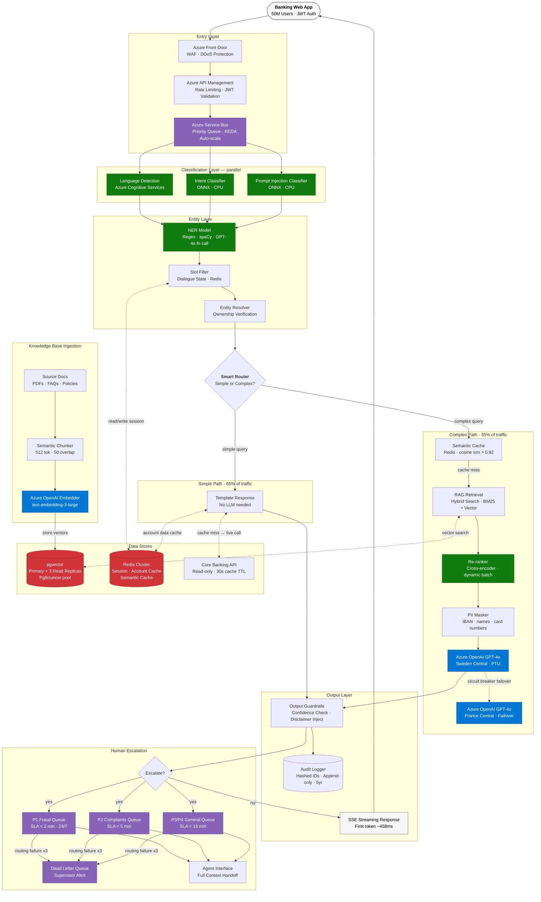

# Banking Chatbot — System Architecture

```mermaid
flowchart TD
    USER(["`**Banking Web App**
    50M Users · JWT Auth`"])

    subgraph ENTRY["Entry Layer"]
        FD["Azure Front Door
        WAF · DDoS Protection"]
        APIM["Azure API Management
        Rate Limiting · JWT Validation"]
        SBQ["Azure Service Bus
        Priority Queue · KEDA Auto-scale"]
    end

    subgraph CLASSIFY["Classification Layer — parallel"]
        LD["Language Detection
        Azure Cognitive Services"]
        IC["Intent Classifier
        ONNX · CPU"]
        PIC["Prompt Injection Classifier
        ONNX · CPU"]
    end

    subgraph ENTITY["Entity Layer"]
        NER["NER Model
        Regex · spaCy · GPT-4o fn call"]
        SF["Slot Filler
        Dialogue State · Redis"]
        ER["Entity Resolver
        Ownership Verification"]
    end

    SR{"`**Smart Router**
    Simple or Complex?`"}

    subgraph SIMPLE["Simple Path · 65% of traffic"]
        TPL["Template Response
        No LLM needed"]
    end

    subgraph COMPLEX["Complex Path · 35% of traffic"]
        SC["Semantic Cache
        Redis · cosine sim > 0.92"]
        RAG["RAG Retrieval
        Hybrid Search · BM25 + Vector"]
        RRK["Re-ranker
        Cross-encoder · dynamic batch"]
        PIIM["PII Masker
        IBAN · names · card numbers"]
        LLM["Azure OpenAI GPT-4o
        Sweden Central · PTU"]
        FLLM["Azure OpenAI GPT-4o
        France Central · Failover"]
    end

    subgraph STORES["Data Stores"]
        PGVEC[("pgvector
        Primary + 3 Read Replicas
        PgBouncer pool")]
        REDIS[("Redis Cluster
        Session · Account Cache
        Semantic Cache")]
        CBANK["Core Banking API
        Read-only · 30s cache TTL"]
    end

    subgraph INGEST["Knowledge Base Ingestion"]
        DOCS["Source Docs
        PDFs · FAQs · Policies"]
        CHUNK["Semantic Chunker
        512 tok · 50 overlap"]
        EMBED["Azure OpenAI Embedder
        text-embedding-3-large"]
    end

    subgraph OUTPUT["Output Layer"]
        OG["Output Guardrails
        Confidence Check · Disclaimer Inject"]
        AL[("Audit Logger
        Hashed IDs · Append-only · 5yr")]
        SSE["SSE Streaming Response
        First token ~458ms"]
    end

    subgraph ESCALATION["Human Escalation"]
        ET{Escalate?}
        P1["P1 Fraud Queue
        SLA < 2 min · 24/7"]
        P2["P2 Complaints Queue
        SLA < 5 min"]
        P34["P3/P4 General Queue
        SLA < 15 min"]
        DLQ["Dead Letter Queue
        Supervisor Alert"]
        AGT["Agent Interface
        Full Context Handoff"]
    end

    %% Entry flow
    USER --> FD --> APIM --> SBQ

    %% Classification — parallel
    SBQ --> LD & IC & PIC

    %% Entity flow
    LD & IC & PIC --> NER --> SF --> ER --> SR

    %% Session state
    SF <-.->|read/write session| REDIS

    %% Routing
    SR -->|"simple query"| TPL
    SR -->|"complex query"| SC

    %% Simple path
    TPL <-.->|"account data cache"| REDIS
    TPL <-.->|"cache miss → live call"| CBANK

    %% Complex path
    SC -->|"cache miss"| RAG
    RAG <-.->|"vector search"| PGVEC
    RAG --> RRK --> PIIM --> LLM
    LLM -.->|"circuit breaker failover"| FLLM

    %% Output
    TPL --> OG
    LLM --> OG
    OG --> ET
    OG --> AL

    %% Escalation routing
    ET -->|"no"| SSE --> USER
    ET -->|"yes"| P1 & P2 & P34
    P1 & P2 & P34 -->|"routing failure x3"| DLQ
    P1 & P2 & P34 --> AGT

    %% Ingestion pipeline
    DOCS --> CHUNK --> EMBED -->|"store vectors"| PGVEC

    %% Styling
    classDef azure fill:#0078d4,color:#fff,stroke:#005a9e
    classDef cache fill:#d13438,color:#fff,stroke:#a4262c
    classDef model fill:#107c10,color:#fff,stroke:#0b5c0b
    classDef queue fill:#8764b8,color:#fff,stroke:#6b4fa0
    classDef io fill:#f7f7f7,stroke:#666,color:#000

    class LLM,FLLM,EMBED azure
    class REDIS,PGVEC cache
    class IC,PIC,NER,RRK,LD model
    class SBQ,P1,P2,P34,DLQ queue
    class USER,SSE io
```
