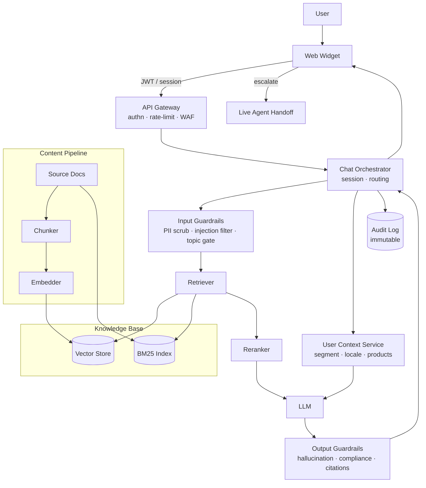

# Bank Chatbot — Architecture Diagram

Companion to [simple_rag_chat.md](simple_rag_chat.md).

## Mermaid



## ASCII fallback

```
                  ┌──────────────┐
                  │     User     │
                  └──────┬───────┘
                         ▼
                  ┌──────────────┐
                  │  Web Widget  │
                  └──────┬───────┘
                         │ JWT
                         ▼
                  ┌──────────────┐
                  │ API Gateway  │  authn · rate-limit · WAF
                  └──────┬───────┘
                         ▼
                  ┌──────────────────┐
                  │  Orchestrator    │◄────────┐
                  └──┬────────────┬──┘         │
                     │            │            │
                     ▼            ▼            │
            ┌────────────┐  ┌──────────────┐   │
            │  Input GR  │  │ User Context │   │
            └─────┬──────┘  └──────┬───────┘   │
                  ▼                │           │
            ┌────────────┐         │           │
            │  Retriever │         │           │
            │  ┌──────┐  │         │           │
            │  │Vector│  │         │           │
            │  │ BM25 │  │         │           │
            │  │Rerank│  │         │           │
            │  └──────┘  │         │           │
            └─────┬──────┘         │           │
                  └─────┬──────────┘           │
                        ▼                      │
                  ┌──────────┐                 │
                  │   LLM    │                 │
                  └────┬─────┘                 │
                       ▼                       │
                  ┌──────────┐                 │
                  │ Output GR│─────────────────┘
                  └────┬─────┘
                       ▼
                  ┌──────────┐    ┌──────────────┐
                  │Audit Log │    │ Live Agent   │
                  └──────────┘    │  Handoff     │
                                  └──────────────┘
```

## Legend

| Element        | Purpose                                                |
|----------------|--------------------------------------------------------|
| Input GR       | PII scrubbing, prompt-injection filtering, topic gate  |
| Output GR      | Hallucination check, compliance lint, citation check   |
| Reranker       | Cross-encoder reorder of hybrid retrieval results      |
| User Context   | Read-only: segment, locale, products held              |
| Audit Log      | Immutable per-turn record for regulator review         |
